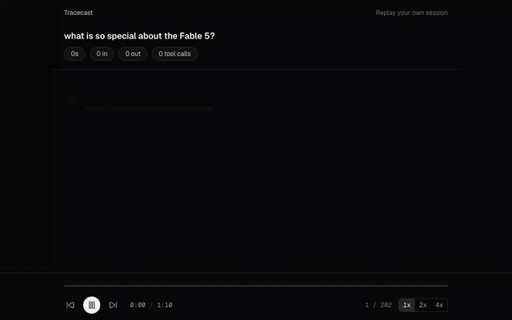

# Tracecast

Replay your agent runs like a screen recording.

Drop a Claude Code session file and get a polished, animated replay with a
shareable link and an embeddable player. Think Loom for agent runs.

**Live:** https://tracecast.vercel.app (demo at `/demo`)

## What it does

- **Replay.** Long pauses are compressed, every step lands in order, tool calls
  resolve as their results arrive. Scrub, step, play at 1x, 2x or 4x.
- **Share.** A redaction review flags API keys, tokens, emails and home
  directory paths before anything is uploaded. Edit or drop steps, pick an
  expiry, get a link.
- **Embed.** One iframe drops the player into a blog post or a PR. Links
  unfurl with a preview card showing title, model, totals and a mini timeline.

Parsing runs in your browser. Nothing leaves it until you click Share.

## How it works

Session files (`~/.claude/projects/<project>/<session>.jsonl`, plus any
`agent-*.jsonl` subagent files) are parsed client side into a normalized
`Trace`. Sharing uploads that normalized JSON, not the raw file, to Supabase
Storage behind a service role key that never reaches the browser.

## Dev

    npm install
    npm run dev          # http://localhost:3000  (dev: /?fixture=long)
    npm test

Replay: space plays, arrows step, 1/2/4 set speed.

## Fixtures and the demo

Fixtures are real sessions, stripped and redacted with
`npm run fixture -- <session.jsonl> <name>` into `fixtures/<name>/`. The folder
is gitignored; the fixture tests skip when it is absent. `npm run demo` rebuilds `lib/demo/trace.json` from the
`subagents` fixture; `npm run gif -- http://localhost:3000` re-records
`docs/demo.gif` (needs Google Chrome and ffmpeg).

## Sharing

Share links need a Supabase project. Apply the migrations in
`supabase/migrations` (dashboard SQL editor, or `supabase link` then
`supabase db push`), copy `.env.example` to `.env.local` and fill in the URL
and service role key. Without them the app works but the Share button reports
that sharing is not configured. The share route allows 10 uploads per hour per
network. Set `NEXT_PUBLIC_SITE_URL` to the deployed origin so link previews use
absolute image URLs.

## Deploy

Vercel, framework preset Next.js, with `SUPABASE_URL`,
`SUPABASE_SERVICE_ROLE_KEY`, `NEXT_PUBLIC_SITE_URL` and optionally
`SHARE_IP_SALT` set for Production.
